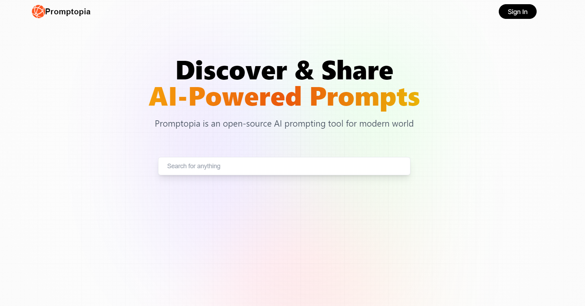

<br/>
<p align="center">
    <a href="https://github.com/itsskofficial/Web2">
    

  <h3 align="center">PromptShare</h3>

  <p align="center">
A prompt sharing application made with Next.js, helping users discover and share good AI prompts.
    <br/>
    <br/>
    <a href="https://itsskofficial-prompt-share.vercel.app">View Demo</a>
    .
    <a href="https://github.com/itsskofficial/Web2/issues">Report Bug</a>
    .
    <a href="https://github.com/itsskofficial/Web2/issues">Request Feature</a>
  </p>
</p>

 

## Table Of Contents

* [About the Project](#about-the-project)
* [Built With](#built-with)
* [Getting Started](#getting-started)
  * [Prerequisites](#prerequisites)
  * [Installation](#installation)
* [Usage](#usage)
* [Contributing](#contributing)
* [License](#license)
* [Authors](#authors)
* [Acknowledgements](#acknowledgements)

## About The Project



PromptShare is an application designed to assist users in discovering and sharing effective AI prompts. Built with Next.js, the project provides a platform for the AI community to exchange, explore, and contribute to a collection of valuable prompts.


## Built With

This section should list any major frameworks that you built your project using. Leave any add-ons/plugins for the acknowledgements section. Here are a few examples.

* [JavaScript](https://developer.mozilla.org/en-US/docs/Web/JavaScript)
* [Next.js](https://nextjs.org/)

## Getting Started

This is an example of how you may give instructions on setting up your project locally.
To get a local copy up and running follow these simple example steps.

### Prerequisites

* **Node.js:**
  
  Ensure you have Node.js installed.

  ```sh
  # To check if Node.js is installed, run:
  node -v

  # To install Node.js, visit: https://nodejs.org/


### Installation

1. **Clone the repo**

    ```sh
    git clone https://github.com/itsskofficial/Web2.git
    ```

2. **Enter into the directory**
    ```sh
    cd Projects/PromptShare
    ```

3. **Install npm packages**

    ```sh
    npm install
    ```
4. **Run the server**

   ```sh
   npm run dev
   
## Usage

PromptShare serves as a platform for users to discover and share effective AI prompts. Whether you're looking for inspiration or want to contribute to the community, PromptShare provides an intuitive interface for seamless interaction.

## Contributing

Contributions are what make the open source community such an amazing place to learn, inspire, and create. Any contributions you make are greatly appreciated.

If you have a suggestion that would make this better, please fork the repo and create a pull request. You can also simply open an issue with the tag "enhancement". Don't forget to give the repository a star! Thanks again!

### Creating A Pull Request

1. Fork the Project
2. Create your Feature Branch (`git checkout -b feature/AmazingFeature`)
3. Commit your Changes (`git commit -m 'Add some AmazingFeature'`)
4. Push to the Branch (`git push origin feature/AmazingFeature`)
5. Open a Pull Request

## License

Distributed under the MIT License. See [LICENSE](https://github.com/itsskofficial/Machine-Learning/blob/main/LICENSE.md) for more information.

## Acknowledgements

* [JS Mastery](https://www.jsmastery.pro/)
