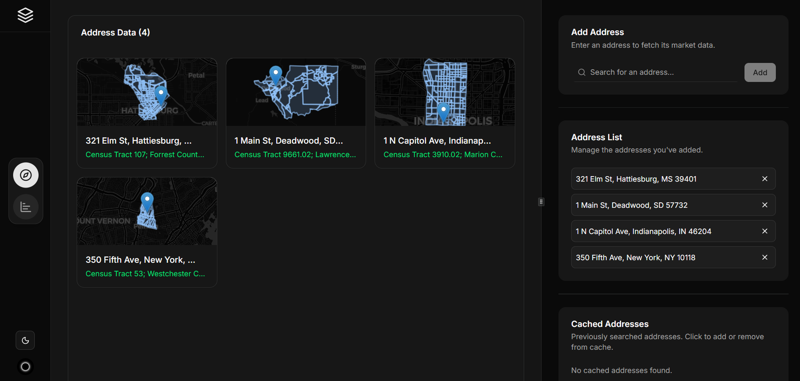

<p align="center">

  <h3 align="center">RealMarket</h3>

  <p align="center">
    A full-stack application to dynamically generate a comprehensive "Population Context" market card for any U.S. address.
    <br/>
    <br/>
    ·
    <a href="https://github.com/itsskofficial/Web2/issues">Report Bug</a>
    ·
    <a href="https://github.com/itsskofficial/Web2/issues">Request Feature</a>
  </p>
</p>

 

## Table Of Contents

* [About the Project](#about-the-project)
* [Built With](#built-with)
* [Getting Started](#getting-started)
  * [Prerequisites](#prerequisites)
  * [Installation](#installation)
* [Usage](#usage)
* [Future Improvements](#future-improvements)
* [Contributing](#contributing)
* [License](#license)
* [Authors](#authors)

## About The Project



RealMarket is a market data automation tool that generates detailed population context cards for any U.S. address in real-time. It sources data from credible public APIs to provide comprehensive metrics on demographics, economic indicators, housing, and migration drivers. The application features interactive visualizations, comparison tools, and an intelligent caching layer for instantaneous results on subsequent requests.

## Built With

This project was built with a modern, high-performance tech stack.

*   [Next.js](https://nextjs.org/) (React & TypeScript)
*   [FastAPI](https://fastapi.tiangolo.com/) (Python)
*   [PostgreSQL](https://www.postgresql.org/)
*   [Docker](https://www.docker.com/)
*   [Tailwind CSS](https://tailwindcss.com/)
*   [shadcn/ui](https://ui.shadcn.com/)
*   [React Query (TanStack)](https://tanstack.com/query/latest)
*   [Zustand](https://zustand-demo.pmnd.rs/)

## Getting Started

To get a local copy up and running, follow these simple steps.

### Prerequisites

You will need the following software installed on your machine:
*   [Docker](https://www.docker.com/get-started/) and Docker Compose
*   [Node.js](https://nodejs.org/) (v20+)
*   API Keys for various services (Census, Walk Score, Google Places, Firebase)

### Installation

1.  **Clone the repo**
    ```sh
    git clone https://github.com/itsskofficial/RealMarket.git
    cd RealMarket
    ```

2.  **Set up Environment Variables**
    *   Create a `.env` file in the backend directory (`src/backend/.env`) using the `.env.template` as a guide.
    *   Create a `.env` file in the frontend directory (`src/frontend/.env`) using the `.env.template` as a guide.
    *   Fill in all the required API keys and Firebase configuration values in these files.

3.  **Build and Run with Docker**
    ```sh
    docker-compose up --build
    ```
    The application will be available at **[http://localhost:3000](http://localhost:3000)**.

## Usage

Once the application is running, you can:
*   Create an account or log in.
*   Use the search bar to enter any U.S. address to generate a new market card.
*   Use the "Explore" mode to view and manage multiple saved cards.
*   Use the "Compare" mode to analyze population trends, demographics, and housing metrics side-by-side for multiple locations.

## Future Improvements

*   **Add County/MSA Benchmark Data:** Enhance charts by overlaying county or MSA trend lines for immediate visual context.
*   **Integrate Hyper-Current Data:** Augment Census data with paid providers (e.g., Esri, Placer.ai) for more timely metrics.
*   **Add More Market Cards:** Extend the architecture to include new data verticals like Job Growth (BLS), Supply Pipeline, and Rent/Sales Comparables.
*   **AI-Powered Insights:** Integrate an LLM to generate natural language summaries of market cards and flag potential risks or opportunities.
*   **Comprehensive Test Coverage:** Implement a full suite of backend (Pytest) and frontend (Cypress/Playwright) tests.
*   **User-Saved Lists & Projects:** Allow users to save, name, and manage lists of addresses, transforming the tool into a persistent workspace.
*   **Cloud-Native Scalability:** Migrate deployment to a container orchestration platform like Kubernetes or AWS ECS for automated scaling.
*   **Intelligent Caching with TTL:** Implement a Time-To-Live (TTL) policy on the cache to ensure data stays reasonably current.

## Contributing

Contributions are what make the open source community such an amazing place to learn, inspire, and create. Any contributions you make are **greatly appreciated**.

If you have a suggestion that would make this better, please fork the repo and create a pull request. You can also simply open an issue with the tag "enhancement". Don't forget to give the repository a star! Thanks again!

### Creating A Pull Request

1.  Fork the Project
2.  Create your Feature Branch (`git checkout -b feature/AmazingFeature`)
3.  Commit your Changes (`git commit -m 'Add some AmazingFeature'`)
4.  Push to the Branch (`git push origin feature/AmazingFeature`)
5.  Open a Pull Request

## License

Distributed under the MIT License. See `LICENSE.md` for more information.